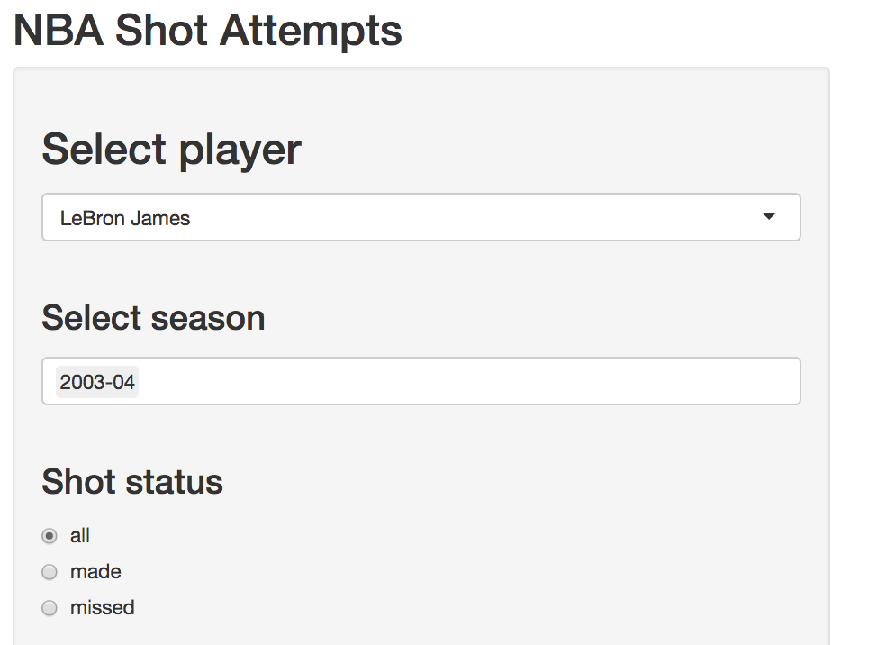

  
This Shiny tutorial was made for the R Ladies NYC meetup on May 8, 2018. Thanks to the NBA New York office for agreeing to host!!

Shiny is R Studio's framework introduced in 2012 for building interactive plots and web applications in `R`. By the end of this tutorial you should have some basic understanding of how Shiny works, and will make and deploy a Shiny app using data pulled from the [NBA stats API](http://stats.nba.com/). Thanks to [Todd Schneider's ballR app](https://github.com/toddwschneider/ballr) inspiration and guidance on how to scrape the data. I highly recommend checking it out!


```{r, echo = FALSE}
knitr::opts_chunk$set(
collapse = TRUE,
warning = FALSE,
fig.width = 6,
fig.asp = .6,
out.width = "90%"
)

```


## Getting started

Before we begin, make sure you have the `shiny`, `plotly`, `tidyverse`, and `rsconnect` packages installed. I have created a template for our app, please [download](Downloads/shiny_nba.zip) and unzip this as well.

```{r, eval = FALSE}
install.packages(c("shiny", "plotly", "tidyverse", "rsconnect"))
```

Run an example of a simple shiny app to ensure the package is installed properly. 

```{r test_shiny, eval = FALSE}
library(shiny)
runExample("01_hello")
```

A slider bar the allows you to change the number bins in the histogram shown.

## Shiny basics

Each Shiny app has a `ui` and a `server` file, both of which we have to define. The `ui` defines a webpage that the user interacts with, it controls layout and appearance. The `server` file is a set of instructions your computer needs to build the app. `R` code is executed in the background, and output depends on the user input and this `R` code.

<body>

<p><cite>image from</cite> https://deanattali.com/blog/building-shiny-apps-tutorial/</p>
</body>

### The shiny framework

All Shiny apps follow the same overall structure. `fluidPage()` controls the page layout for the UI. We define `server` as a function with arguments `input` and `output`.

```{r shiny_template, eval = FALSE}
library(shiny)
ui <- fluidPage()
server <- function(input, output) {}
shinyApp(ui = ui, server = server)
```

This template itself is a minimal Shiny app, try running the code.  Copy this template into a new file called `app.R`, and save it in a new folder. After saving the file, you should see a _Run App_ button at the top, indicating RStudio has recognized the file as a Shiny app.


Two ways to create Shiny apps:

1. Put both `ui` and `server` code into single file called `app.R`, ideal for simple apps. If you are using a single file, the file **must** be called `app.R` for the app to run.
1. Create separate `ui.R` and `server.R` files, ideal for more complicated apps.

We will use the second approach for this tutorial. This is the preferable way to write apps unless your app is super simple. You can initialize a Shiny app using either approach right from RStudio:


Select **Shiny Web App...** and the following will pop up:


Select **Multiple File** to generate an app with separate `ui.R` and `server.R` files. The app initialized above will be stored in a folder called "new_app" on the Desktop.To run the app you can do either of the following:

1. Open the `server.R` or `ui.R` file and click the Run App button.
1. Enter `shiny::runApp("~/Desktop/new_app/")` in your R console


### Input options 

Input options (usually) go in the `ui.R` file. Input is defined through input functions called [widgets](https://shiny.rstudio.com/tutorial/written-tutorial/lesson3/). These are text elements a user can interact with, like scroll bars or buttons. Our app uses `selectInput()` to create a drop-down menu, but many other input functions are available.

**insert new image here that shows widgets and their code in two columns using screen shots from unfinished NBA app**

All input functions have `inputId` and `label` as the first two arguments. The `inputId` is a string that the server side will use to access the value of the user input. For example, if `inputId = "slider_widget"` then on the server side you would use `input$slider_widget` to use its value.`label` is the title for the widget that will show up in the UI.


**Exercise**: Try adding another widget to the sidebar.

**where should I cover html wrapper???**

The `hr()` bit is a wrapper for the html tag `<hr>` which creates a horizontal line. There are a bunch of [awesome html wrapper functions](https://shiny.rstudio.com/articles/tag-glossary.html) to help you customize your user interface.


### Output options 

Output options (also usually) go in the `ui.R` file. The first argument of all output functions is "outputId", which is used to identify each output and therefore must be unique for each output. Examples include `plotOutput()`, `textOutput()`, `tableOutput()`.

The input and output options defined in your UI are each list objects that get read in as arugments to your `server()` function.

**show example code here too? what other types of things should I say about what output options do?**

**Debugging tip**: Make sure you have a comma between each input call and output call! Commas are needed between elements for the UI but not for the server, which operates more like regular `R` code.

### render* statements

**google to get better distinction between render and output**

Render statements go in the `server.R` file. They take user input from the widgets and build reactive output to display in the UI. Examples including `renderTable()` to make tables, `renderText()` for text, and `renderPlot()` for certain plots. 

Input, output, and render statements are the simplest examples of the **reactive programming** paradigm that Shiny uses. We will cover reactivity in more detail later.
 

## NBA Shots Data

Download and unzip the [shiny_nba](Downloads/shiny_nba.zip) folder provided. Notice what's in the folder:

* **an R project called `shiny_nba.Rproj`**
* **the `nba_shots.RData` data on shots taken by LeBron James, Kevin Durant, Russell Westbrook, Stephen Curry, and Carmelo Anthony scraped from the [NBA stats API](http://stats.nba.com/)**
* **a `helper.R` file with functions `R` code our app uses**
* a `ui.R` file
* a `server.R` file


**add in clip of lebron making a really far shot**

### R project

Double click the [shiny_nba.Rproj](https://support.rstudio.com/hc/en-us/articles/200526207-Using-Projects) to open up RStudio and automatically set your working directory to this folder. This makes it easier to load the data and source the helper functions using relative file paths (**cite why this is important or why you should use R projects in genneral**)

**explain what it is and why you always use R projects**

### The data

Because we have opened the folder using the R project we can load the data without hard-coding the directory where it is located. 

* describe the data
    * talk about different variables
    * what shots are we actually looking at here?
* props to the Todd Schneider's app and what it does, say that we have 
* remove columns in the data that we don't actually use

```{r, message = FALSE}
library(tidyverse)
load("nba_shots.RData")

nba_shots %>% 
  group_by(player_name) %>%
  summarize(n())
  
```


### Helper file

show that empty court plot is ggplot object! show that you can make it a certain color if you want!

* talk about what the helper functions do

```{r empty_court}
source("helpers.R")

gg_court = make_court()
gg_court
```

Just makes a cool court plot that is a ggplot object you can put other layers on top of. The code is adapted from Todd Schneider. Files of helper functions are often included in shiny apps but they don't have to be! All of this code could be placed within the `server.R` file instead - but since none of it is updated by user input I chose to put it in a separate file to keep the code cleaner.


### Court plot

Next let's add a plot. We are going to plot the locations of the attempted shots made by the selected NBA star in a given season, like LeBron James in his rookie 2003-2004 season (below). 

```{r court_plot, eval = TRUE, message = FALSE}
player_data = filter(nba_shots, player_name == "LeBron James", season == "2003-04")


gg_court + geom_point(data = player_data, alpha = 0.75, size = 2.5,
                          aes(loc_x, loc_y, color = shot_made_flag)) +
  scale_color_manual("", values = c(made = "blue", missed = "orange"))
```

### Plotly

Some of the plots for our app use Plotly, which is a framework for creating interative graphics that has a variety of implementations, including the `plotly` library in `R`. The Plotly framework has some nice benefits:

* High quality plots produced with a few lines of code
* Since (unlike in Shiny) its interactivity does not require running a server, plots can be placed in R Markdown documents that are hosted on GitHub (like this tutorial)!
* Also compatible with Shiny framework

We can make Plotly box plot of shooting distances for our NBA players with just two lines of code. Notice that you can hover, zoom, unclick players, and download the image.

```{r, message = FALSE, fig.width = 10, fig.asp = .4}
library(plotly)

plot_ly(data = nba_shots, y = ~shot_distance, color = ~player_name, type = "box") %>% 
  layout(legend = list(x = 0.2, y = 1.0))
```

**Note**: There is also a Plotly wrapper, `ggplotly`, for ggplot2 objects. The code below makes the same boxplot using `ggplot()` then translates it to Plotly. This can be useful for making quick Plotly plots when exploring your data if you're more used to ggplot syntax. From my experience the `plot_ly()` functions works better than the `ggplotly()` function, so I would recommend using the `plot_ly` function or just sticking with `ggplot()` if you don't need the extra interactivity. I do use `ggplotly() to quickly identify outliers when doing exploratory analysis on a new dataset.

```{r eval = TRUE, message = FALSE}
nba_boxplot = nba_shots %>%
  ggplot(aes(player_name, shot_distance, fill = player_name)) + geom_boxplot() +
  theme(legend.position = "none")

ggplotly(nba_boxplot)
```

## NBA Shots App

I refer back to what's in the `shiny_nba`  folder. The `ui.R` and `server.R` files define the actual Shiny app.

* **a `ui.R` file**
* **a `server.R` file**
* an R project called `shiny_nba.Rproj`
* the `nba_shots.RData` data
* a `helper.R` file 

Run the app by opening the `shiny_nba.Rproj` then typing `runApp()` into your console or opening the `ui.R` or `server.R` file and clicking the Run App button. You see a simple app with only the title "NBA Shot Attempts" because code for widgets and plots is commented out. 

### Sidebar layout

The app has a gray box on the left side, called the side bar, which is where widgets will appear. The white space on the right side is called the main panel, and this is where plots will appear. This design is called `sidebarLayout()`. [Many more flexible layouts are possible](https://shiny.rstudio.com/articles/layout-guide.html) as well, but we won't cover them here. Uncomment the following line in the `ui.R` to add a `selectInput` widget that allows the user to select a basketball player.

```{r, eval = FALSE}
## uncomment in ui.R
selectInput("player_choice", label = h3("Select player"),
            choices = players, selected = "LeBron James") #, # uncomment comma to add another widget
```

We also want another widget that allows the user to select a particular season of play for a given player. **But that requires the possible choice of seasons to depend on the `player_choice` input!** By adding a `uiOutput()` statement in `ui.R` and a  `renderUI()` statement in `server.R` we allows the UI options to adapt to user input. Uncomment the following code in your app.

```{r, eval = FALSE}
## uncomment in ui.R
uiOutput("season_choice") #,

## uncomment in server.R
output$season_choice <- renderUI({
  seasons = nba_shots %>% filter(player_name == input$player_choice) %>%
    distinct(season) %>% pull()
  
  selectizeInput("season_choice", label = "Select season", choices = seasons,
                selected = seasons[1], multiple = TRUE)
  })
```

Getting an error that looks like this? 

```ERROR: Error sourcing /Users/juliawrobel/Downloads/shiny_nba 2/ui.R```

Make sure to uncomment the `,` between input calls in the `ui.R` file.

<br>
Last we'll add a radio button widget:

```{r, eval = FALSE}
## uncomment in ui.R
radioButtons("shots_made", label = h3("Shot status"), choices = list("all", "made", "missed"))
```

You should now have the following widgets in your sidebar:



**Exercise: add another widget to your UI.**


### Court plot

Let's add the plot that shows the spatial distribution of shots made. We need a `plotOutput` statement in the `ui.R` file to tell Shiny where the plot should appear in the layout of the app, and a `renderPlot` statement in the `server.R` file that constructs the plot.

```{r, eval = FALSE}
## uncomment in ui.R
plotOutput("court_shots") #, uncomment comma when adding next plot

## uncomment in server.R
  output$court_shots <- renderPlot({
    # subset data by selected player and season(s)
    player_data = filter(nba_shots, player_name == input$player_choice,
                         season %in% input$season_choice)

    # create plot
    gg_court + geom_point(data = player_data, alpha = 0.75, size = 2.5,
                          aes(loc_x, loc_y, color = shot_made_flag, shape = season)) +
      scale_color_manual("", values = c(made = "blue", missed = "orange"))
  })
```

**Debugging tip**: if the non-Shiny version of your plot isn't working, your Shiny version won't either! Make sure to test your code before placing it in the Shiny framework.

All of the server code that changes based on user input goes within the `renderPlot` statement. We allow the plot to change based on choices of player or season, which are stored in `input$player_choice` and `input$season_choice`.

**Exercise: try editing the app so that the court shots plot also changes based on the radio button input.**

### Plotly and Shiny

To add Plotly plots to Shiny apps you need to use the functions `plotlyOutput()` and `renderPlotly()` rather than `plotOutput()` and `renderPlot()`. Add the Plotly boxplot of shooting distances to the `shiny_nba` app by uncommenting the code below. We allow the user to filter on whether shots were made or missed by accessing the `input$shots_made` UI input from  the `radioButtons` widget. 

```{r, eval = FALSE}
## uncomment in ui.R
plotlyOutput("shot_distances")

## uncomment in server.R
output$shot_distances <- renderPlotly({
  nba_shots %>%
    filter(if(input$shots_made != 'all')  (shot_made_flag == input$shots_made) else TRUE) %>%
    plot_ly(y = ~shot_distance, color = ~player_name, type = "box") %>%
    layout(showlegend = FALSE)
  })
```

Make sure to uncomment the `,` between output calls in the `ui.R` file. No commmas are needed between code chunks in the server file.

The [Plotly Shiny gallery](https://plot.ly/r/shiny-gallery/) contains many more examples of what's possible when using Plotly and Shiny together. 

## Getting fancier

Now you have a cool Shiny app! I'm want to discuss a few extra things you can do with Shiny. I've included an expanded version of the app shiny_nba app. Download it [here](Downloads/shiny_nba_complete.zip), then open the `shiny_nba_complete.Rproj` and run the app. The app has a few updates:

* Reactive expressions in the `server.R` for more efficient code
* Tabbed layout, with one plot on each tab
* New plots on the third and fourth tabs
* Mouse-driven coupled events in the fourth tab

### Reactivity

[Shiny uses reactive programming](https://shiny.rstudio.com/articles/reactivity-overview.html), which is what allows output to update based on user input. There are three types of reactive objects in Shiny's reactive programming paradigm: reactive sources, reactive conducters, and reactive endpoints:


In what we have done so far, `input$` statements are the reactive sources and `output$` statements are the reactive endpoints. We haven't used any reactive conducters. From our simple `shiny_nba` app:


However, sometimes Shiny apps require slow computation, and if one source has multiple endpoints then these computations will need to be done several times. Reactive conducters can speed this up. [Reactive expressions](https://shiny.rstudio.com/tutorial/written-tutorial/lesson6/) are an implementation of reactive conducters that take an `input$` value, do some operation, and _cache_ the results. The code `our_expression = reactive({})` creates a reactive expression called `our_expression`. Since reactive expressions are actually functions, we call the reactive expression using parenthesis: `our_expression()`.

The fancier `shiny_nba_complete` app uses a reactive expression to store a data set that has been filtered on the current value of `input$player_name`. In the code below, from `server.R` of this app, a dataframe called `player_data` is defined using a reactive expression, then accessed by the reactive endpoint `output$court_shots` by calling `player_data()`.

```{r, eval = FALSE}
  # subset data by selected player using reactive expression
  player_data = reactive({
    filter(nba_shots, player_name == input$player_choice)
  })
  
  # create court_shots plot
  output$court_shots <- renderPlot({
    gg_court + geom_point(data = filter(player_data(), season %in% input$season_choice),
                          alpha = 0.75, size = 2.5,
                          aes(loc_x, loc_y, color = shot_made_flag, shape = season)) +
      scale_color_manual("", values = c(made = "blue", missed = "orange"))
  })
```


Since both `output$court_shots` and `output$court_position` use this data, we save ourselves from doing the computation twice. The reactive diagram for this app is:
  
  
* observe

### Coupled events

When using Plotly and Shiny together you can use 'mouse events' to create new user-driven plots. **describe example you ultimately use**. [Coupled events](https://plot.ly/r/shiny-coupled-events/) allow you (for example) to click or select points on a plot and have information based on those clicks or selections show up in another plot.


I'm not sure how useful this plot is, but it is sort of cool and it highlights how coupled events can work when using Shiny and Plotly together.

### Deploying your app

While we've already run our app locally, hosting it publicly can be more tricky. You can't just host it on GitHub like you would an [R Markdown or blogdown website](http://www.emilyzabor.com/tutorials/rmarkdown_websites_tutorial.html) because `R` needs to be running in the background. However, you can publicly host shiny apps at [Shinyapps.io](https://shiny.rstudio.com/articles/shinyapps.html)

The `rsconnect` package deploys Shiny apps to shinyapps.io. Load this package and create your own account at [shinyapps.io](https://www.shinyapps.io/).

```{r}
library(rsconnect)
```

* add in steps and show how you would do this after you have already taken certain steps

## Additional resources

* [Embedding Shiny in Rmarkdown documents](https://rmarkdown.rstudio.com/authoring_shiny.html)
* ["Case Studies in Shiny": Dean Attali's short course at DataCamp](https://www.datacamp.com/courses/building-web-applications-in-r-with-shiny-case-studies)
* [Gallery of user-submitted Shiny apps](http://www.showmeshiny.com/)
* [Shiny cheatsheet](http://shiny.rstudio.com/images/shiny-cheatsheet.pdf)
* [Eliminate warnings produced by Plotly with Shiny](https://github.com/ropensci/plotly/issues/985)

